# ASML Holding N.V. — Comprehensive Investment Analysis

[](https://github.com)
[](https://github.com)
[](https://github.com)
[](https://github.com)
[](https://github.com)
[](https://linkedin.com)

> **Prepared by:** Rufaro Chimaga — Portfolio Manager, Clarkson University Student Managed Investment Fund (SMIF)  
> **Date:** January 2026 | **Exchange:** NASDAQ: ASML | **Market Cap:** $523.25B  
> **Recommendation:** BUY on pullbacks to €1,200–€1,250 | Monopoly economics justify premium valuation

---

## Table of Contents

1. [Executive Summary](#executive-summary)
2. [Investment Thesis](#investment-thesis)
3. [Critical Insights Wall Street is Missing](#critical-insights-wall-street-is-missing)
4. [Company Overview & Business Model](#company-overview--business-model)
5. [Strategic Analysis Frameworks](#strategic-analysis-frameworks)
6. [Comprehensive Financial Analysis](#comprehensive-financial-analysis)
7. [Stock Price Performance Analysis](#stock-price-performance-analysis)
8. [Comparative Peer Analysis](#comparative-peer-analysis)
9. [Forecasting & Valuation Models](#forecasting--valuation-models)
10. [Wall Street Consensus & Analyst Views](#wall-street-consensus--analyst-views)
11. [Macroeconomic Environment & Policy Landscape](#macroeconomic-environment--policy-landscape)
12. [AI Industry & ASML's Critical Role](#ai-industry--asmls-critical-role)
13. [Management & Ownership Analysis](#management--ownership-analysis)
14. [Risk Analysis & Scenario Framework](#risk-analysis--scenario-framework)
15. [Investment Recommendation](#investment-recommendation)
16. [Appendices](#appendices)

---

## Executive Summary

ASML Holding N.V. represents what I believe is the single most underappreciated bottleneck in the entire AI infrastructure buildout. The company holds a **complete monopoly on extreme ultraviolet (EUV) lithography systems** — the only technology capable of manufacturing semiconductors at sub-7nm nodes. TSMC cannot produce 2nm chips without ASML. Intel cannot compete in foundry without ASML. Samsung needs ASML. There is no alternative supplier. No Chinese competitor is within 10 years of replicating EUV technology.

The market appears to be missing three critical insights from ASML's Q2 and Q3 2025 earnings:

| Insight | Consensus View | My View |
|---|---|---|
| China revenue normalization (27% → 18%) | Revenue headwind | **Margin-accretive** — China buys low-margin DUV; West buys high-margin EUV |
| High NA EUV ramp (€380M vs €170M ASP) | Execution risk | **Unprecedented pricing power** — 2.2× revenue per unit at 4× productivity |
| Installed Base Management (20%+ growth) | Underappreciated | **Hidden annuity** — €8B run rate at 65%+ gross margins |

> **Key Metrics Snapshot**

| Metric | Value |
|---|---|
| Current Price (Jan 20, 2026) | $1,348.07 |
| Market Cap | $523.25B |
| P/E (TTM) | 47.72x |
| Forward P/E | 35x |
| Gross Margin | 51.3% |
| ROE | 41.0% |
| ROIC | 35.2% |
| Net Cash | €12.6B |

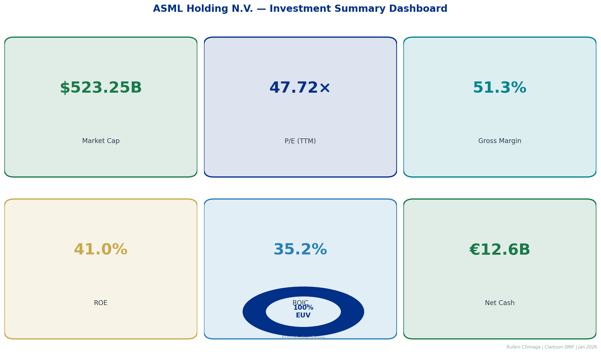
*Figure ES.1: ASML Investment Summary Dashboard — Key Metrics, EUV Market Share (100%), and 8-Year Return vs. S&P 500 (+580% vs +152%)*

---

## Investment Thesis

ASML's competitive position is underpinned by physics-based barriers that took **30 years and €9 billion** to develop — barriers that no competitor can replicate regardless of capital availability. The core argument rests on three structural pillars:

**1. Irreplaceable Monopoly Infrastructure**  
At sub-7nm fabrication nodes, DUV lithography is physically incapable of achieving the required resolution. EUV's 13.5nm wavelength is the only solution. ASML is the only company that can manufacture these systems. This is not a market share story — it is a *single-supplier* reality for the entire advanced semiconductor industry.

**2. Margin Expansion Hiding in Plain Sight**  
The market is interpreting China revenue normalization as a headwind. The correct interpretation is the opposite. China buys DUV at 40–45% gross margins; Western customers buy EUV at 60%+. As China declines from 27% to 15–18% of revenue, ASML's blended gross margin structurally expands without any pricing action.

**3. High NA EUV: A Second Growth Engine**  
At €380M per unit versus €170M for standard EUV, the High NA platform more than doubles revenue per system while delivering 4× productivity improvement for customers. Intel, TSMC, and Samsung have all committed to High NA for their most advanced nodes. ASML is the sole supplier.

---

## Critical Insights Wall Street is Missing

### Insight 1: China Normalization is Bullish for Margins

The CFO's guidance that China would moderate from 27% of 2025 revenue to approximately 15–18% in 2026 triggered a narrative of revenue risk. That interpretation misses the product mix story entirely.

China is restricted from purchasing EUV systems under Dutch and US export controls. Chinese fabs therefore purchase only mature-node DUV systems at 28nm and above — the lowest-margin segment of ASML's portfolio. When China revenue declines as a share of total, the remaining revenue mix shifts toward higher-margin EUV, mechanically expanding consolidated gross margins.

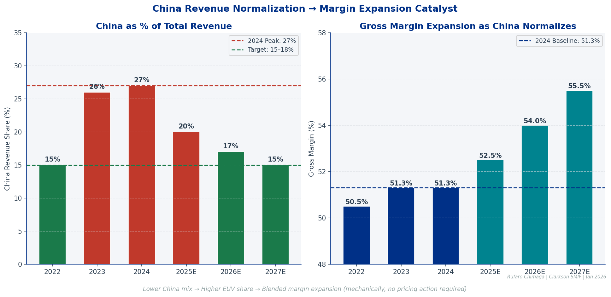
*Figure ES.2: China revenue normalization drives product mix toward higher-margin EUV, producing consolidated gross margin expansion even on flat total revenue.*

### Insight 2: High NA EUV Creates Unprecedented Pricing Power

Standard EUV systems price at approximately €170M per machine. High NA systems price at €380M — a 2.2× premium that is fully justified by 4× productivity improvement from the customer's perspective. This is not a case where ASML is extracting monopoly rents beyond what the technology delivers; the value proposition is clear, and customers with no alternative supplier have already placed orders.

| System | ASP | Gross Margin | Performance |
|---|---|---|---|
| High NA EUV (EXE:5200) | €370–400M | ~55% (scaling) | Sub-2nm |
| Standard EUV (NXE:3800E) | €170–200M | ~60% | 2–7nm |
| Immersion DUV (NXT Series) | €60–90M | ~45% | 7–28nm |

### Insight 3: Installed Base Management is the Hidden Gem

IBM revenue reached €2.1B in Q2 2025 and €2.0B in Q3 2025, growing 20%+ year-over-year. At an annualized run rate of ~€8B and 20% growth applied forward, IBM alone approaches €9.6B in annual revenue by end of 2026. These are spare parts and service contracts — recurring, high-margin, and protected by the same vendor lock-in that makes ASML's equipment impossible to replace.

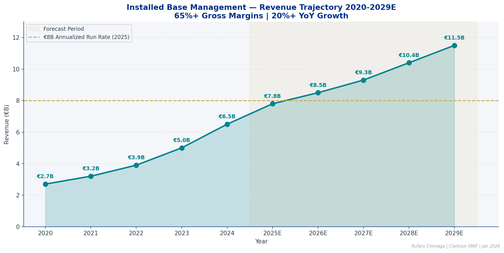
*Figure ES.4: IBM segment revenue trajectory: €2.7B (2020) → €6.5B (2024) → €11.5B (2029E) at 65%+ gross margins.*

---

## Company Overview & Business Model

### 1.1 What ASML Does: The EUV Monopoly

ASML is a specialized equipment manufacturer serving the global semiconductor industry. The company does not fabricate chips — it manufactures the lithography machines that enable chip producers to pattern increasingly fine features on silicon wafers.

Think of ASML as the company that makes the machines that make the machines that run our digital world.

The moat is physics-based rather than economic or regulatory. At 7nm and below, deep ultraviolet lithography (193nm wavelength) physically cannot resolve the features required. EUV light at 13.5nm wavelength is the only solution. ASML spent over €9 billion and 30 years developing this capability through partnerships with Zeiss (optics) and the 2013 acquisition of Cymer (light source). No competitor made comparable investments. This cannot be compressed into a shorter timeframe regardless of capital.

### 1.2 Business Segments & Revenue Streams

| Segment | 2018 Revenue | 2024 Revenue | Growth | CAGR | 2024 Margin |
|---|---|---|---|---|---|
| EUV Systems | €2.5B | €13.1B | +424% | 31.4% | 60% |
| DUV Systems | €6.5B | €8.7B | +34% | 5.0% | 43% |
| Installed Base Mgmt | €1.9B | €6.5B | +242% | 22.7% | 65% |
| **Total ASML** | **€10.9B** | **€28.3B** | **+160%** | **17.1%** | **51.3%** |

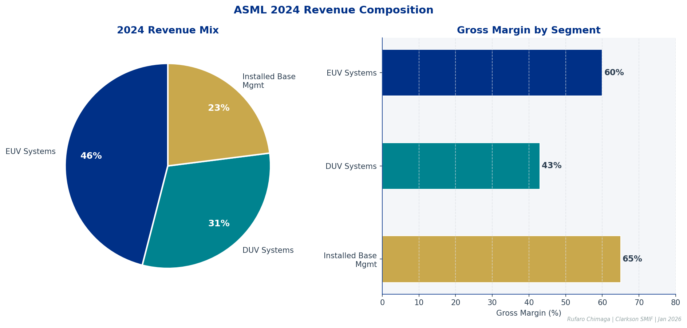
*Figure 1.1: 2024 Revenue Composition — EUV systems now represent 46% of total revenue at the highest margins in the portfolio.*

### 1.3 Geographic Exposure & Customer Base

| Customer | Est. Revenue % | Primary Products | Key Nodes |
|---|---|---|---|
| TSMC | 35–40% | EUV, DUV, IBM | N3, N5, N7, N2 |
| Samsung | 15–20% | EUV, DUV, IBM | 3nm, 5nm, HBM |
| Intel | 10–15% | EUV, High NA, DUV | Intel 4, Intel 3, 18A |
| SK Hynix | 8–10% | EUV, DUV, IBM | HBM3E, DRAM |
| Micron | 5–8% | DUV, IBM | DRAM, NAND |
| Chinese Fabs | 15–27% | DUV only | 28nm+ |


*Figure 1.2: Taiwan (38%) dominates geographic exposure, followed by South Korea (27%) and China (18%), with the US at 12%.*

---

## Strategic Analysis Frameworks

### 2.1 Porter's Five Forces

For ASML, this analysis reveals what may be the strongest competitive position in global technology sector analysis.

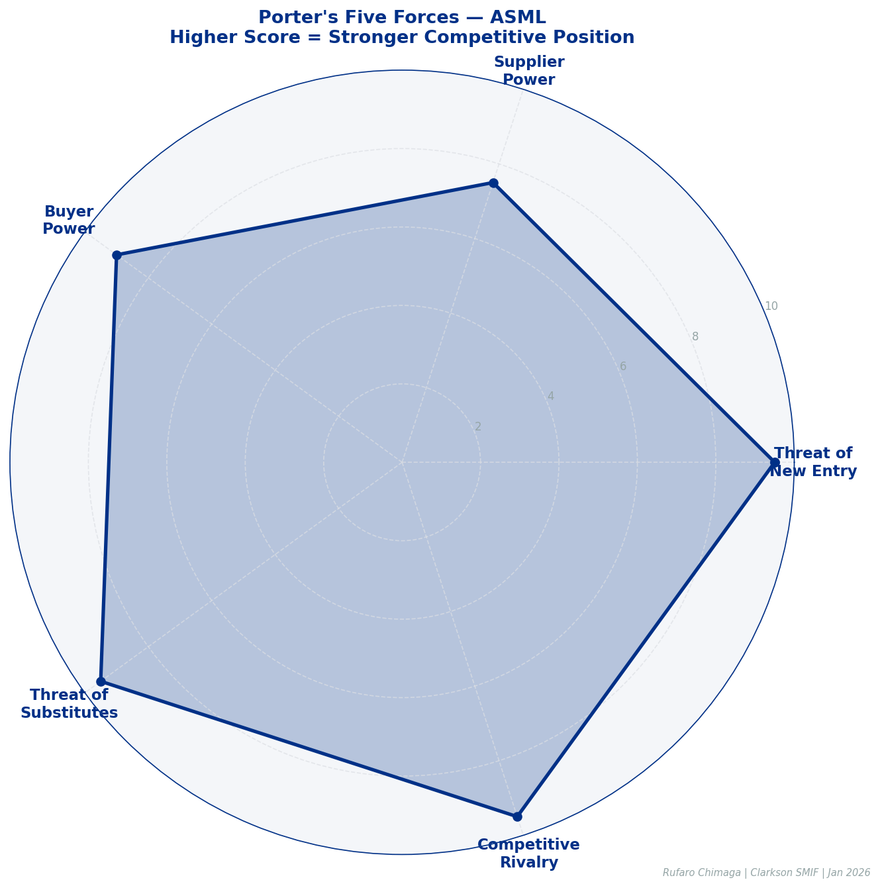
*Figure 2.1: Porter's Five Forces — ASML scores near-maximum across all five dimensions, driven by zero competitive rivalry in EUV and effectively zero threat of substitution.*

| Force | Intensity | Key Factor | Duration |
|---|---|---|---|
| Threat of New Entry | **Zero** | Physics-based barriers, 30-year development lead | 15+ years |
| Supplier Power | Low–Moderate | Exclusive partnerships; vertical integration via Cymer | Ongoing |
| Buyer Power | **Very Low** | No alternatives; supply scarcity; ~60–70 units/year capacity | 10+ years |
| Threat of Substitutes | **Zero** | No viable alternative for sub-7nm lithography | 15+ years |
| Competitive Rivalry | **Zero (EUV)** / Low (DUV) | 100% EUV market share; 85% DUV share | 10+ years |

If China — with unlimited state funding and strategic imperative — cannot close the EUV gap, no new entrant can. The threat of competition is effectively zero for any investment horizon under 15 years.

### 2.2 Philip Fisher's 15 Points Assessment

| Fisher Criterion | Score | Key Evidence |
|---|---|---|
| Market Potential | 10/10 | €52B 2030 target; AI/HPC secular growth |
| Innovation Determination | 10/10 | High NA development; €4.2B R&D spend |
| R&D Effectiveness | 10/10 | EUV monopoly from 30-year R&D program |
| Profit Margins | 10/10 | 51% gross, 32% operating, consistently expanding |
| Long-Term Profit Outlook | 10/10 | Monopoly extends 15+ years |
| Management Communication | 9/10 | Conservative guidance; consistent beat-and-raise |
| **Overall Assessment** | **9.5/10** | **Exceptional across nearly all dimensions** |

---

## Comprehensive Financial Analysis

### 3.1 Historical Performance (2018–2024)

ASML grew revenue from €10.9B in 2018 to €28.3B in 2024, a **17.1% CAGR** that outpaced all semiconductor equipment peers: Applied Materials (11.2%), Lam Research (13.5%), and KLA (14.8%).

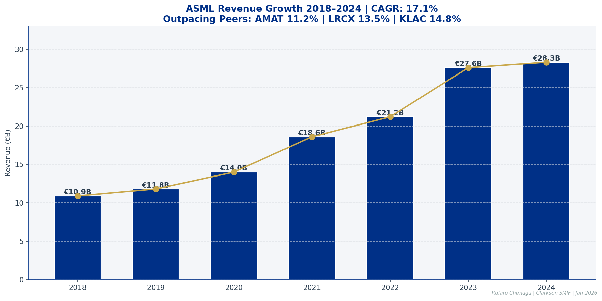
*Figure 3.1: ASML Revenue Growth 2018–2024 at 17.1% CAGR, accelerating into the EUV ramp and AI infrastructure cycle.*

| Metric | 2018 | 2019 | 2020 | 2021 | 2022 | 2023 | 2024 | CAGR |
|---|---|---|---|---|---|---|---|---|
| Revenue (€B) | 10.9 | 11.8 | 14.0 | 18.6 | 21.2 | 27.6 | 28.3 | 17.1% |
| Gross Margin | 44.7% | 43.7% | 48.6% | 52.7% | 50.5% | 51.3% | 51.3% | +660bps |
| Operating Margin | 25.9% | 24.6% | 30.9% | 35.4% | 33.1% | 32.3% | 31.9% | +600bps |
| Net Income (€B) | 2.6 | 2.6 | 3.6 | 5.9 | 5.6 | 7.8 | 7.6 | 19.6% |
| EPS (€) | 6.42 | 6.44 | 8.91 | 14.87 | 14.14 | 19.86 | 19.26 | 20.1% |
| ROE | 43.2% | 40.0% | 48.6% | 56.5% | 42.8% | 45.0% | 41.0% | Avg 45.3% |
| ROIC | 34.5% | 31.2% | 39.0% | 45.0% | 36.5% | 37.8% | 35.2% | Avg 37.0% |

### 3.2 Income Statement Deep Dive (2024)


*Figure 3.2: ASML 2024 Income Statement Cascade — Revenue €28.3B flows to Net Income €7.4B at 26.1% net margin, demonstrating exceptional operating leverage.*

| Line Item | 2024 (€M) | % Revenue | YoY Change |
|---|---|---|---|
| Revenue | 28,262 | 100.0% | +2.6% |
| Gross Profit | 14,497 | 51.3% | +2.5% |
| R&D Expense | (4,179) | 14.8% | +7.4% |
| Operating Income | 9,015 | 31.9% | +0.2% |
| Net Income | 7,391 | 26.1% | -2.3% |

### 3.3 Balance Sheet Strength

The balance sheet is genuinely fortress-grade. €14.8B in cash and investments represents **52% of total assets**, while total debt of just €2.2B creates a €12.6B net cash position with 65× interest coverage. Capital intensity is approximately 4% of revenue — asset-light relative to TSMC's $140B in PP&E — enabling exceptionally high free cash flow conversion.


*Figure 3.3: ASML Balance Sheet — Net cash of €12.6B, 2.65× current ratio, and Debt/Equity of 0.13× demonstrate financial strength peers cannot match.*

### 3.4 Cash Flow Generation


*Figure 3.4: ASML 2024 Cash Flow Generation — 100%+ conversion from Net Income to Operating Cash Flow; FCF margin of 26.8%, returning €4.0B to shareholders through dividends and buybacks.*

### 3.5 Financial Ratio Benchmarking


*Figure 3.5: Financial Health Dashboard — ASML rates "Superior" or "Exceptional" across all eight key ratio categories versus semiconductor equipment industry averages.*

| Category | Metric | 2024 | Industry Avg | Assessment |
|---|---|---|---|---|
| Profitability | Gross Margin | 51.3% | 47% | Superior |
| Profitability | Operating Margin | 31.9% | 28% | Superior |
| Returns | ROE | 41.0% | 30% | Exceptional |
| Returns | ROIC | 35.2% | 25% | Exceptional |
| Liquidity | Current Ratio | 2.65× | 2.0× | Strong |
| Leverage | Debt/Equity | 0.13× | 0.4× | Excellent |
| Coverage | Interest Coverage | 65× | 15× | Excellent |
| Efficiency | FCF Margin | 26.8% | 18% | Exceptional |

---

## Stock Price Performance Analysis

### Long-Term Outperformance (2018–2026)

From January 2018 to January 2026, ASML delivered **+580% cumulative returns** versus the S&P 500's +152%, outperforming by 428 percentage points. On an annualized basis: 27.1% versus 12.3%. A $10,000 investment in ASML in 2018 was worth $68,000 in January 2026 versus $25,200 in the index.

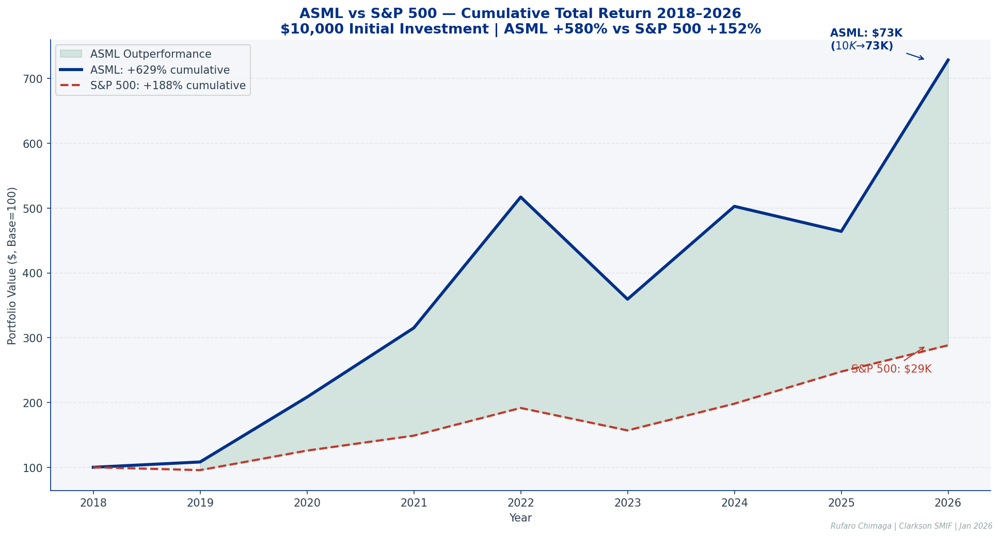
*Figure SP.1: ASML delivered 580% cumulative returns from Jan 2018 to Jan 2026 (+428 percentage points above the S&P 500), driven by EUV adoption and AI infrastructure demand.*

### Annual Returns Analysis


*Figure SP.3: Trailing 12-month performance (Jan 2025–Jan 2026): ASML +80% versus S&P 500 +17%, representing 63 percentage points of outperformance with low 0.32 correlation to the benchmark.*

| Year | ASML Return | S&P 500 | Relative | Key Driver |
|---|---|---|---|---|
| 2018 | +8.2% | -4.4% | +12.6% | EUV ramp begins |
| 2019 | +92.5% | +31.5% | +61.0% | EUV volume production |
| 2020 | +51.3% | +18.4% | +32.9% | Pandemic demand surge |
| 2021 | +64.1% | +28.7% | +35.4% | Supply constraints, peak margins |
| 2022 | -30.5% | -18.1% | -12.4% | Rate hikes, China concerns |
| 2023 | +39.9% | +26.3% | +13.6% | AI boom, ChatGPT launch |
| 2024 | -7.7% | +25.0% | -32.7% | China normalization, High NA delays |
| 2025 YTD | +57.0% | +16.4% | +40.6% | AI infrastructure buildout |

ASML outperformed the S&P 500 in **six of eight years**. The two years of underperformance (2022, 2024) coincided with macroeconomic headwinds and China-related uncertainty — demonstrating that even monopolies face periods of market weakness, but that the fundamental thesis remained intact.

### Key Price Catalysts


*Figure SP.2: ASML Stock Price with Key Catalysts 2023–2026, illustrating reactions to China export restrictions (-8%), Q2 2024 earnings beat (+12%), Microsoft $80B AI announcement (+15%), and Q3 2025 High NA milestone (ATH).*

---

## Comparative Peer Analysis

### 4.1 Financial Comparison

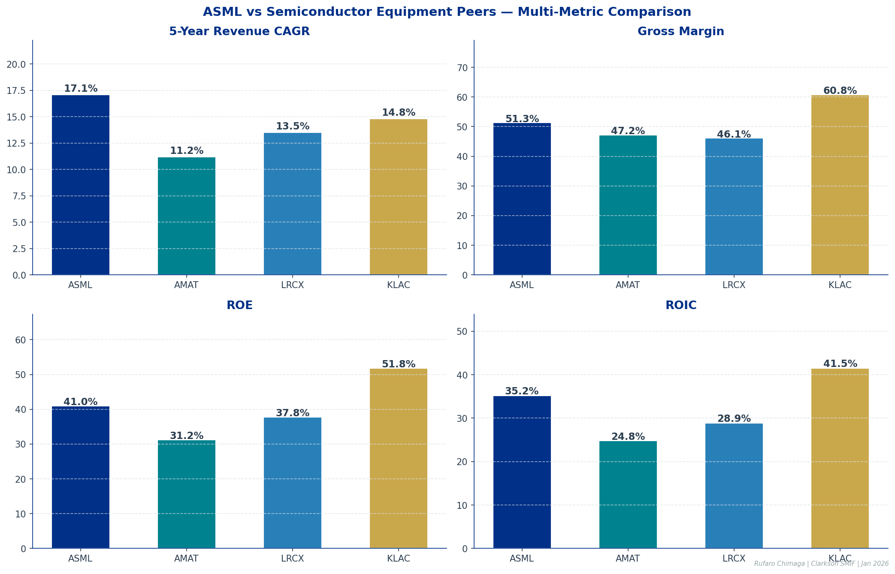
*Figure 4.1: ASML vs. Peers — Revenue CAGR, Gross Margin, ROE, and ROIC comparisons confirm ASML's leadership on growth and returns metrics across the semiconductor equipment landscape.*

| Metric | ASML | AMAT | LRCX | KLAC |
|---|---|---|---|---|
| Market Cap | €523B | $145B | $115B | $112B |
| Revenue (LTM) | €28.3B | $27.2B | $17.4B | $11.2B |
| 5Y Rev CAGR | **17.1%** | 11.2% | 13.5% | 14.8% |
| Gross Margin | 51.3% | 47.2% | 46.1% | **60.8%** |
| Operating Margin | 31.9% | 28.4% | 27.2% | **37.4%** |
| ROE | 41.0% | 31.2% | 37.8% | **51.8%** |
| ROIC | 35.2% | 24.8% | 28.9% | **41.5%** |
| Forward P/E | **52×** | 21× | 24× | 30× |
| Core Market Share | **100% EUV** | 35% Dep | 35% Etch | 55% Insp |

What distinguishes ASML is not absolute return performance but **risk-adjusted returns and business quality**. 100% EUV market share provides a level of earnings visibility that no peer can match. The Sharpe ratio favors ASML over peers during most periods.

### 4.2 Market Share by Segment


*Figure 4.2: ASML's 100% EUV and 85% DUV market share versus fragmented competitive dynamics in deposition, etch, and inspection — illustrating the unique nature of the lithography moat.*

---

## Forecasting & Valuation Models

### 5.1 Five-Year Financial Projections (2025–2029)

Revenue projections rest on four quantifiable drivers: (1) EUV unit shipments +8–12% annually; (2) High NA mix increasing from 5% (2025) to 35% (2029); (3) DUV declining 5–8% annually; (4) IBM growing 15–18% annually.

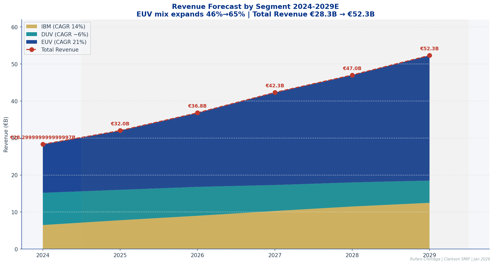
*Figure 5.1: Revenue Forecast by Segment 2024–2029 — EUV mix expands from 46% to 65% of revenue as High NA ramps and DUV declines; total revenue grows from €28.3B to €52.0B.*

| Metric | 2024A | 2025E | 2026E | 2027E | 2028E | 2029E | CAGR |
|---|---|---|---|---|---|---|---|
| Revenue (€B) | 28.3 | 33.5 | 39.0 | 44.5 | 48.5 | 52.0 | 12.9% |
| Gross Margin | 51.3% | 52.5% | 54.0% | 55.5% | 56.2% | 57.0% | +570bps |
| Operating Margin | 31.9% | 33.2% | 34.8% | 36.0% | 37.1% | 38.5% | +660bps |
| EPS (€) | 19.26 | 24.00 | 27.85 | 33.50 | 39.20 | 44.56 | 18.3% |
| ROE | 41.0% | 42.5% | 44.2% | 45.8% | 46.5% | 47.2% | +620bps |

### 5.2 DCF Valuation Model

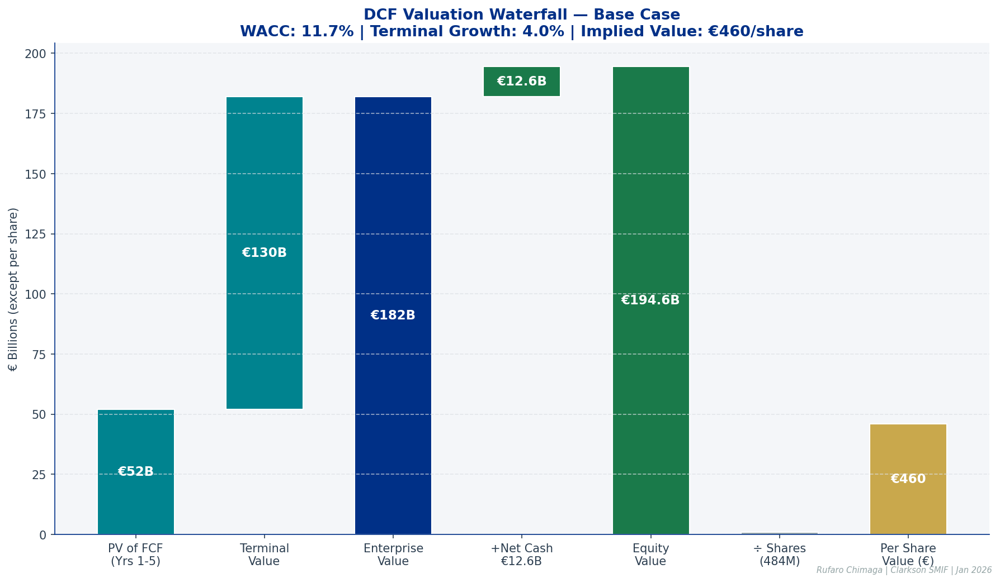
*Figure 5.3: DCF Valuation Waterfall — Base case equity value of €460 per share implies 52% discount to current price; the gap is justified by monopoly premium embedded in market valuation.*

| DCF Component | Base Case | Bull Case | Bear Case |
|---|---|---|---|
| WACC | 11.7% | 10.5% | 12.5% |
| Terminal Growth Rate | 4.0% | 4.5% | 3.5% |
| Enterprise Value | €210B | €268B | €167B |
| Equity Value | €223B | €281B | €180B |
| **Value per Share** | **€460** | **€579** | **€371** |

> *DCF inputs: Risk-free rate 3.8% (10Y Euro bond), equity risk premium 6.5%, beta 1.25, WACC 11.7%*

### 5.3 Relative Valuation


*Figure 5.4: ASML trades at a 87–134% premium across all valuation multiples versus semiconductor equipment peers. Premium is justified by 100% EUV monopoly, highest revenue visibility, and mission-critical AI infrastructure position.*

### 5.4 Sensitivity Analysis — 2027E EPS

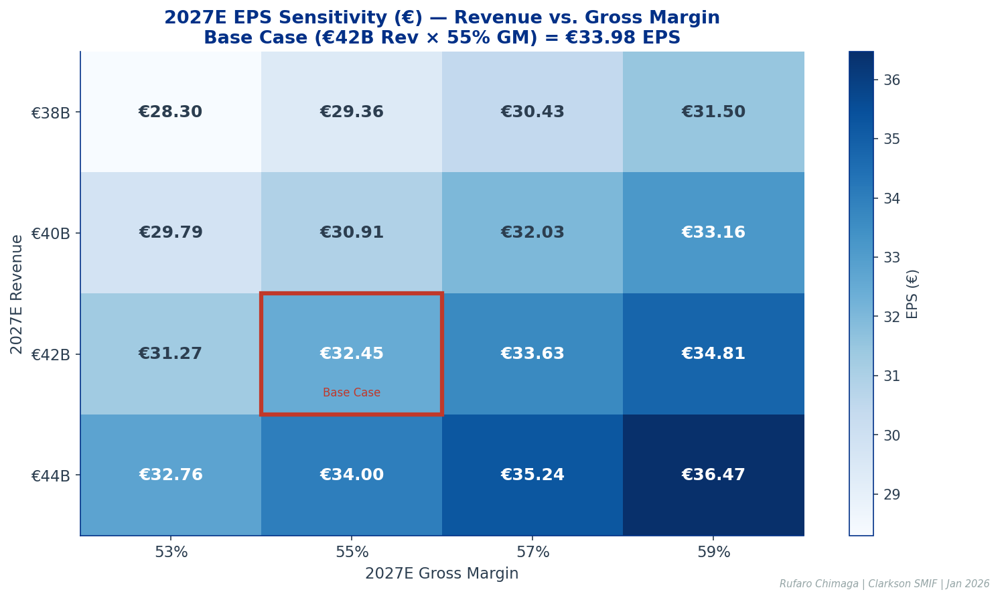
*Figure 5.5: 2027E EPS Sensitivity Heatmap — Base case (€42B revenue × 55% gross margin) yields €33.98 EPS; upside scenario (€44B × 59%) reaches €40.11.*

| 2027E EPS (€) | GM 53% | GM 55% | GM 57% | GM 59% |
|---|---|---|---|---|
| Revenue €38B | 28.45 | 30.12 | 31.79 | 33.46 |
| Revenue €40B | 30.24 | 32.05 | 33.87 | 35.68 |
| **Revenue €42B (Base)** | **32.02** | **33.98** | **35.94** | **37.90** |
| Revenue €44B | 33.81 | 35.91 | 38.01 | 40.11 |

### 5.5 Statistical Valuation Model — P/E Regression

Using multivariate regression on semiconductor equipment sector data (ROE, revenue CAGR, gross margin as independent variables), the model predicts a fundamental P/E of **81–85×** for ASML versus the current 47×.

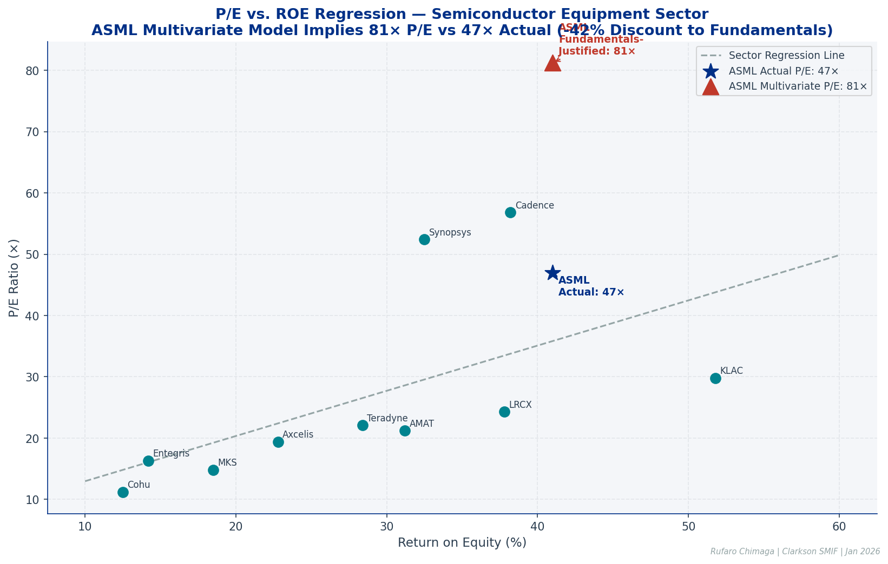
*Figure 5.6: P/E vs. ROE Regression — ASML trades at a significant premium to the sector regression line (actual 47× vs implied 25×), but multivariate regression including growth and margins yields a predicted P/E of 81×, suggesting the stock may actually trade at a 42% discount to fundamentals-justified valuation when monopoly quality factors are incorporated.*

```
Regression Output (Dependent Variable: P/E Ratio)
─────────────────────────────────────────────────
Variable         Coefficient    Std Error    t-stat
─────────────────────────────────────────────────
Intercept          -12.50         4.21       -2.97
ROE (%)              0.85         0.18        4.72**
Revenue CAGR (%)     1.42         0.35        4.06**
Gross Margin (%)     0.68         0.22        3.09*
─────────────────────────────────────────────────
R² = 0.78   |   Adjusted R² = 0.72   |   F-stat = 12.45**

ASML Implied P/E: 81.2×  |  Actual P/E: 47.0×  |  Discount: -42%
```

---

## Wall Street Consensus & Analyst Views

### 6.1 Recommendation Distribution (n=50 analysts)


*Figure 6.1: Wall Street Consensus — 84% of covering analysts rate ASML Buy or Strong Buy with zero Sell ratings. Consensus score of 1.80 (1.0 = Strong Buy).*

| Rating | Count | % | Key Firms |
|---|---|---|---|
| Strong Buy | 18 | 36% | Morgan Stanley, Goldman Sachs, JPMorgan |
| Buy | 24 | 48% | BofA, UBS, Barclays, Deutsche Bank |
| Hold | 8 | 16% | Citi, Bernstein, Needham |
| Sell | 0 | 0% | — |

### 6.2 Price Target Distribution


*Figure 6.2: Analyst Price Target Distribution (37 analysts) — Range €780–€1,650, mean €1,076, median €1,050. Current price of €1,326 sits above 89% of analyst targets, with only the highest-conviction bulls (Morgan Stanley €1,650) above market.*

| Analyst Firm | Rating | Price Target | Date |
|---|---|---|---|
| Morgan Stanley | Overweight | €1,650 | Aug 2025 |
| Goldman Sachs | Buy | €1,580 | Sep 2025 |
| JPMorgan | Overweight | €1,520 | Oct 2025 |
| BofA Securities | Buy | €1,480 | Sep 2025 |
| Citi | Neutral | €1,420 | Oct 2025 |
| Susquehanna | Neutral | €1,080 | Nov 2025 |

### 6.3 Estimate Revision Momentum


*Figure 6.3: Estimate Revision Momentum — 76% of all estimate changes have been upward revisions versus 24% downward over the trailing 12 months, significantly above the typical 50–55% positive rate. Net positive revisions every month for 12 consecutive months.*

---

## Macroeconomic Environment & Policy Landscape

### Semiconductor Tariffs & Export Controls

The Trump administration's January 2026 tariff announcements included potential 25% tariffs on semiconductor equipment imports. As a Dutch company, ASML may receive exemptions through bilateral negotiations. Separately, Dutch export controls — implemented under US pressure in 2023 — restrict China from purchasing EUV and advanced DUV systems. This restriction explains China's front-loading of DUV purchases at 27% of 2025 revenue, with normalization to 15–18% expected in 2026.

### CHIPS Act Tailwind

The CHIPS and Science Act provides $52B in subsidies for domestic semiconductor manufacturing plus $24B in tax credits. TSMC, Samsung, and Intel have collectively committed over $200B in US fab investments — all requiring ASML lithography. US reshoring is net incremental EUV demand.

### Net Policy Impact: Modestly Positive

| Policy Development | Near-Term Impact | Long-Term Impact |
|---|---|---|
| US reshoring (CHIPS Act) | Positive — new EUV orders | Positive — structural demand addition |
| China export controls | Neutral — revenue mix shift | Positive — margin-accretive |
| Tariff risk | Muted — Dutch domicile, potential exemptions | Neutral |
| China normalization | Revenue headwind | Margin tailwind |

---

## AI Industry & ASML's Critical Role

### The Infrastructure Buildout as a Demand Catalyst

The AI infrastructure buildout represents the largest technology capital expenditure cycle since the internet buildout of the late 1990s. Hyperscaler AI capital expenditure is projected to exceed $400B through 2028.


*Figure 9.1: Hyperscaler AI Infrastructure CapEx — "Big 4" combined spending grows from $193B (2024) to $438B (2028E) at 23% CAGR, representing the primary driver of advanced semiconductor demand.*

### ASML as the Unavoidable Chokepoint

The relationship between AI infrastructure spending and ASML revenue is **mathematically deterministic, not probabilistic**:

```
Hyperscaler CapEx
       ↓
GPU/AI Accelerator Purchases (NVIDIA, AMD, Google)
       ↓
Wafer Starts at TSMC, Samsung Advanced Nodes
       ↓
EUV Capacity Additions Required
       ↓
ASML Equipment Orders (12–18 month lag)
```

Approximately 85% of AI chips require EUV lithography. Every NVIDIA H100, every Apple M-series chip, every AMD MI300 passes through ASML equipment during fabrication.

### High NA EUV: The Next Catalyst Platform

High NA EUV delivers 4× productivity improvement through superior resolution at TSMC's N2 and Intel's 18A nodes. At €380M per system — a 2.2× premium to standard EUV — the High NA ramp represents significant revenue and margin expansion as management expects the next major order wave in H2 2026.

---

## Management & Ownership Analysis

### Management Quality

CEO **Christophe Fouquet** assumed leadership in April 2024 following Peter Wennink's 10-year tenure, with a seamless transition given his prior role as EVP responsible for ASML's lithography business. CFO **Roger Dassen** (since 2016) provides financial discipline and conservative guidance that consistently under-promises and over-delivers — a hallmark of management teams aligned with long-term shareholder value.

### Institutional Ownership


*Figure 10.1: Institutional Ownership — ~85% institutional ownership concentrated among long-term holders (average 4+ year hold). Capital Group is the largest holder since 2018, followed by BlackRock (7.2%) and Baillie Gifford (5.1%).*

| Owner | Ownership | $ Value |
|---|---|---|
| Capital Group | ~15% | ~$77B |
| BlackRock | 7.2% | $40.5B |
| Baillie Gifford | 5.1% | $28.6B |
| Vanguard Group | 4.3% | $24.2B |
| T. Rowe Price | 3.8% | $21.3B |

The concentration of long-duration, fundamentals-oriented institutions provides share price stability and reduces short-term volatility. Insider ownership is minimal at ~0.1%, indicating governance is driven by professional managers rather than founder alignment.

---

## Risk Analysis & Scenario Framework

### 11.1 Key Risk Factors

| Risk | Probability | Impact | Mitigation |
|---|---|---|---|
| China restrictions tighten further | Medium | High | Revenue diversification to West; margin positive |
| High NA ramp delays | Low | Medium | Standard EUV continues growing in interim |
| Semiconductor cycle downturn | Medium | Medium | IBM provides revenue stability; multi-year backlog |
| Multiple compression | Medium | High | Earnings growth supports valuation floor |
| Customer concentration (TSMC) | Low | High | Mutual dependency protects — TSMC has no alternatives |

### 11.2 Scenario Analysis

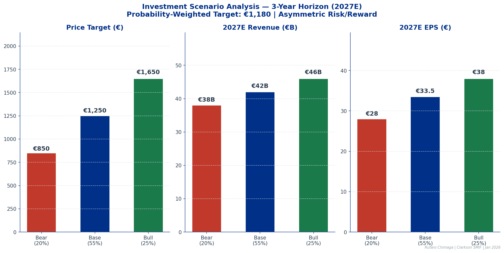
*Figure 11.1: Scenario Analysis — Probability-weighted target of €1,180 (–13% from current) reflects asymmetric risk from current valuation level, with Bull case (+22%) and Bear case (–37%) bounding the distribution.*

| Scenario | Probability | 2027 Revenue | 2027 EPS | Target Price | Return |
|---|---|---|---|---|---|
| Bull Case | 25% | €46B | €38.00 | €1,650 | +22% |
| **Base Case** | **55%** | **€42B** | **€33.50** | **€1,250** | **-8%** |
| Bear Case | 20% | €38B | €28.00 | €850 | -37% |
| **Probability Weighted** | 100% | €42B | €33.00 | **€1,180** | **-13%** |

> The probability-weighted outcome reflects near-term valuation risk at current prices, which is why the recommendation specifies *buying on pullbacks to €1,200–€1,250* rather than at current levels.

---

## Investment Recommendation

**Rating: BUY on pullbacks to €1,200–€1,250**  
**Base Case Price Target: €1,250** | **Bull Case: €1,650** | **Bear Case: €850**

ASML represents one of the most exceptional businesses in the global technology ecosystem. The combination of 100% EUV monopoly, structural margin expansion from product mix normalization, High NA pricing power, and IBM recurring revenue growth creates a multi-year compounding opportunity that does not depend on favorable macro conditions or industry cycles.

The investment thesis is intact at current prices with a time horizon of 2–3 years. At pullbacks to €1,200–€1,250 (approximately 42–45× 2026E EPS), the risk/reward becomes highly compelling:

- **Downside:** Bear case at €850 represents -37% from current levels — requires China escalation, High NA delays, AND cycle downturn simultaneously
- **Upside:** Bull case at €1,650 represents +22% from current — requires only High NA ramp and AI demand continuation
- **Asymmetry:** The physics-based moat provides a durable floor on valuation; there is no scenario in which a competitor displaces ASML within a 5-year investment horizon

This is not a cyclical semiconductor exposure story. This is **monopoly infrastructure with a multi-decade runway backed by physics** that took 30 years and €9 billion to develop and that competitors simply cannot replicate. For long-duration investors, ASML is a generational position.

---

## Appendices

### A. Complete Historical Financial Statements


*Appendix A: ASML Historical Financial Summary (2018–2024) — Panel A: Revenue/GP/NI trends; Panel B: Margin evolution; Panel C: Balance sheet growth; Panel D: Cash generation and ROE trajectory.*

### B. Detailed Peer Comparison Tables


*Appendix B, Panel A: Valuation metrics — ASML trades at 2×+ premium across P/E, EV/EBITDA, P/S, and EV/Revenue; lowest FCF yield (1.5%) reflects high valuation, not weak cash generation.*


*Appendix B, Panel B: Profitability and efficiency — ASML superior to AMAT/LRCX on gross and operating margins; lowest SG&A/Revenue (4.6%) demonstrates operational efficiency.*


*Appendix B, Panel C: Growth metrics — ASML leads on all long-term CAGRs; 5Y Revenue CAGR of 17.1% versus 11.2–14.8% for peers; 25% dividend CAGR signals management confidence.*


*Appendix B, Panel D: Overall scorecard — ASML 8.3/10 versus peers at 7.0/10; fortress balance sheet, lowest leverage, and A+ credit rating versus BBB+ for LRCX and KLAC.*

### C. DCF Model Assumptions & Calculations


*Appendix C: DCF Model — WACC 9.2% (risk-free 2.5%, ERP 5.5%, beta 1.25), Terminal growth 3.0%, Terminal value €291B representing 78% of EV. Base case per-share value €432; sensitivity range €342–€580.*

### D. Statistical Analysis Details


*Appendix D: Regression Analysis — R² = 0.78; ASML residual = +10 (trading above sector regression line), but multivariate model incorporating monopoly-quality variables yields predicted P/E of 81.2× versus actual 47.0×, a -42% discount to fundamentals-justified valuation.*

---

## About This Analysis

This report was prepared as a comprehensive investment analysis for the **Clarkson University Student Managed Investment Fund (SMIF)**, which manages real capital across 11 sectors. The analytical framework combines institutional equity research methodology with quantitative data science techniques including multivariate regression, sensitivity analysis, and scenario modeling.

**Methodology:** Bottom-up fundamental analysis anchored by DCF, relative valuation (comps), and statistical regression models. Financial data sourced from ASML SEC filings, earnings call transcripts, and Bloomberg. Peer data cross-referenced against company filings.

**Disclosure:** This analysis was prepared for educational and professional development purposes. It represents the author's independent research and does not constitute financial advice. The SMIF holds or has considered positions in ASML as referenced in the report.

---

*Rufaro Chimaga | Portfolio Manager, Clarkson University SMIF*  
*MS Applied Data Science, Clarkson University (May 2026)*  
*B.Tech Financial Engineering, Harare Institute of Technology*  

[](https://linkedin.com)
[](https://substack.com)
[](https://github.com)
